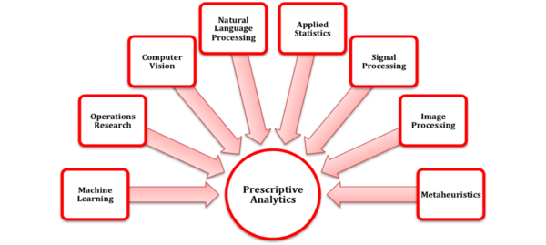

```{r setup, include=FALSE}
knitr::opts_chunk$set(echo = TRUE)
```
## Data Science Related Career
[Business Analysts](https://www.kingland.com/internships) are a part of the Kingland Data Science team. They serve as a portal between the **data oriented** needs of clients and the development team of Kingland. They use different data manipulation and visualization oriented packages in *R* and *Python* to perform prescriptive analysis for clients. Business Analysts represent the more people oriented aspect of the field. Effective communication and people skills are need in order to properly interact with clients.




## R Code Version Check
I am running:
``` {r echo = FALSE} 
version 
```
    
## Git Version Check
I am running Git version:
```{bash echo = FALSE}
git --version
```


    